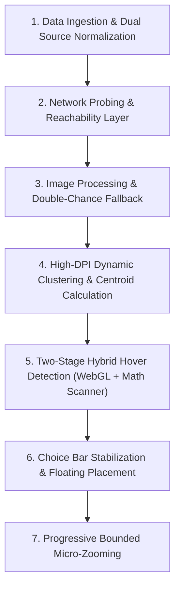

# Cesium Overview Map Marker & Clustering Algorithm Reference

This document serves as a comprehensive technical reference for the interactive 2D map marker placement, dynamic clustering, hybrid collision detection, and viewport synchronization logic used in the overview map. 

The implementation is fully contained in:
📂 **[`cesium-map-markers.js`](file:///c:/Users/User/.antigravity/Projects/DataPortalV2/public/assets/js/cesium-map-markers.js)**

---

## 🗺️ Architectural Workflow Overview

The overview map script is a self-invoking module that runs alongside `cesium-map.js`. It orchestrates data normalization, robust asset fetching, device-pixel-ratio responsive rendering, mathematical boundary transformations, and smooth camera transitions.



---

## 🔬 Core Algorithms & Technical Details

### 1. Data Ingestion & Source Normalization (`normalizeLocations`)

The system aggregates data from two distinct sources:
1. **Static Configuration:** Local fallback data read from `../../data/locations.json`.
2. **Dynamic Database API:** Live models fetched from the database endpoint at `/api/map-data`.

#### **Implementation Details:**
* **Precedence:** Live database rows take precedence. Any coordinate matching an existing ID in the local fallback is skipped to prevent visual duplicates.
* **API Origin Rewriting (`rewriteApiUrl`):** If database elements contain absolute URL structures populated with outdated/local origins (e.g., `http://localhost:3000/uploads/...`), the system dynamically extracts the URL pathname and rewrites it to use the active host origin configured in `window.AppConfig.baseUrl` (or standard `window.location.origin`). This guarantees that uploads load perfectly across all staging, development, and production hosts.

---

### 2. Network Resilience & Origin Probing

To eliminate ugly network error logs (`ERR_CONNECTION_REFUSED`) appearing in the browser's developer console when asset servers or backends are unreachable, the system implements a pre-flight probe.

#### **Implementation Details:**
* **Reachability Testing (`checkOriginReachable`):** Before rendering any uploaded user pin, the script checks if the image's origin differs from the current page's origin. If it does, a background `fetch()` probe is executed with a low-priority `HEAD` method and `mode: 'no-cors'`.
* **Caching & Timeouts:** Probes are limited by a 3-second timeout timer. The results (`true` or `false`) are stored in a persistent object cache (`_originReachable`) indexed by origin domain. Subsequent images sharing the same domain immediately utilize the cached state, meaning only a **single network probe** is ever fired per domain. If unreachable, the pin silently drops directly to its canvas-rendered placeholder.

---

### 3. Image Pre-processing & Double-Chance Fallback (`preloadPinImage`)

Instead of handing raw URLs directly to Cesium (which could trigger async render lag or layout offsets), all images undergo HTML5 Canvas pre-processing to output normalized, base64-encoded Data URLs.

#### **Implementation Details:**
* **Canvas Wrapping:** Successfully preloaded thumbnails are painted onto an HTML5 `<canvas>` containing an optional clean inset white border (3px padding). The canvas is then serialized into a `image/png` data string via `toDataURL()`.
* **Double-Chance Fallback:**
  1. The system attempts to load the primary URL (e.g. database-uploaded preview image).
  2. If the primary load fails or throws an error, the script attempts a **second-chance** load targeting the derived static asset file: `../../assets/img/front-pages/locations/{locationId}_pin_image.jpg`.
  3. If both fail, the canvas paints a beautiful placeholder (`makePinPlaceholderDataUrl`) rendering the location's name inside a dark-indigo box with a thick border, ensuring a physical, readable pin is *always* generated.

---

### 4. Dynamic HD Clustering & Centroid Math

Cesium's native clustering groups nearby pins but suffers from low-resolution labels, fixed radii, and rendering latency. The system implements a robust math-driven clustering override:

#### **Implementation Details:**
* **Ultra-HD Canvas Clustering:** In the `clusterEvent` listener, Cesium's default text tags are disabled (`cluster.label.show = false`). The script dynamically compiles an upscaled HTML5 Canvas using a Device Pixel Ratio of `3` (`dpr = 3`), drawing an ultra-sharp, anti-aliased blue square with white border and a bold geometric sans-serif count digit centered inside. This canvas is serialized as a base64 PNG data URL and assigned to `cluster.billboard.image`.
* **Dynamic Pixel Range Scaling (`getClusterPixelRange`):** To prevent dense geographic regions from remaining clustered when zoomed in, the clustering radius (`pixelRange`) scales dynamically:
  * **In 2D Mode:** The camera's frustum width (`frustum.right - frustum.left`) is monitored. It smoothly interpolates between `80px` (zoomed out at 400 km) down to `50px` (zoomed in at 10 km).
  * **In 3D Mode:** The camera's viewport degrees (`north - south`) are computed. It smoothly interpolates between `80px` (zoomed out at 3.0° or above) down to `50px` (zoomed in at 0.05° or below).
  * **Behavior:** By transitioning to a smooth dynamic linear interpolation (lerp) down to `50px` (a safe overlap cushion that is slightly wider than a single pin's 48px width) at close details, we completely guarantee that pins never visually overlap at medium views. When the user clicks the cluster badge, the camera performs a precise bounding flight targeting *only* the specific locations in the cluster. This zooms the viewport in extremely close so their screen distance is much greater than `50px`, allowing them to split beautifully and stay split with pristine spacing. Camera calculations are throttled to every `180ms` via `throttledUpdateClusterPixelRange`.
* **Unified Debounced Camera Zoom-Split Engine:** To bypass Cesium's SCENE2D limitation where mouse-wheel frustum zooms do not fire camera coordinate-based recalculations, a unified debounced handler coordinates the camera `moveEnd` and `changed` listeners:
  * **Debouncing Process:** The `changed` listener tracks the active frustum transition, clearing and resetting a `150ms` timer (`cameraChangeDebounceTimer`). When scroll-zooming ends, `handleCameraChangeEnd()` force-dirties the clusterer (`enabled = false; enabled = true`) to evaluate all coordinate distances with the fresh camera frustum.
  * **Scalability:** By debouncing to 150ms, a single recalculation runs only after zooming finishes, completely eliminating frame-rate drops or layout calculations when rendering hundreds of locations.
* **Centroid Projection (`cluster._wgs84Position`):** On every cluster event, the system calculates the geographic average (centroid) of all bundled locations in the cluster:
  
  $$\text{CentroidLongitude} = \frac{1}{N} \sum_{i=1}^{N} \text{Lon}_i$$
  
  $$\text{CentroidLatitude} = \frac{1}{N} \sum_{i=1}^{N} \text{Lat}_i$$
  
  This centroid coordinate is stored inside the cluster billboard primitive as `_wgs84Position`, acting as a precise anchor for hovers and screen-space transforms.

---

### 5. Two-Stage Hybrid Hover Detection (`getLocationsForHover`)

Because WebGL-based frame buffer pickers (`scene.pick`) often fail in 2D views, high-DPI zoom situations, or due to offset bugs, a dual-layer pick system is used:

```
[Hover Movement] ──► [Stage 1: visual WebGL pick (scene.pick)]
                          │
                          ├──► Found? ──► [Show Hover Bar]
                          │
                          └──► Not Found? ──► [Stage 2: Coordinate Math Scanner]
                                                    │
                                                    ├──► 2.1 Cluster Proximity check (40px)
                                                    │
                                                    └──► 2.2 Single-Pin Proximity check (36px)
```

#### **Implementation Details:**
* **Stage 1: Visual GPU Pick:** Attempts to collide with visual billboard primitives using `scene.pick(clickCoords)`. If it matches an active cluster or billboard, it immediately extracts the underlying location records.
* **Stage 2: Mathematical Viewport Scanner:** Projects the WGS84 positions of all single locations and clusters to window pixel coordinates using the camera matrices:
  * **Cluster Scanner (`getClusterAtScreenPosition`):** Iterates over all active clusters inside `viewer._activeClusters` (tracked via clean explicit-clearing triggers on recalculation and camera transition passes to prevent memory leakage and frame-based race conditions), projects the centroid `_wgs84Position`, and scans if the cursor falls within a `40px` radius. If multiple clusters overlap, the conflict is mathematically resolved by picking the cluster closest to the cursor.
  * **Single-Pin Y-Offset Adjustment:** Single pins have their origin anchored at the *bottom* center of the visual asset. To align the collision detection with the visual center, the screen Y coordinate is offset:
    
    $$\text{PinCenterY} = \text{ScreenPosY} - \text{PIN\_SEARCH\_HALF\_H}$$
    
  * **Single-Pin Proximity (`getLocationsInRadius`):** If no cluster is hovered, the math scanner returns the single closest pin within a `36px` boundary. Individual locations are filtered out if they are currently swallowed by an active cluster billboard.

---

### 6. Hover Choice Bar Placement & Stabilization

The dynamic floating choice panel (`#locationChoiceBar`) displays information about the hovered item:

#### **Implementation Details:**
* **Transition Cushioning (`isMouseOverBarExpanded`):** An invisible `30px` padding is projected around the choice bar. This ensures that when the cursor moves from the map pin to the floating bar across the physical `2px` spacing gap, the panel remains open, providing smooth interactive transitions.
* **DOM Jitter Prevention (`_lastRenderedKey`):** The IDs of the locations are sorted and joined to form a unique signature (e.g. `"KK_OSPREY,KB_3DTILES"`). The hover bar's HTML is *only* rebuilt if this signature changes. This avoids expensive reflows and prevents UI flickering as the user moves their cursor over the same active area.
* **High-DPI Alignment:** Scale factor calculations (`scaleX`/`scaleY`) are applied to map coordinate projections to ensure precise pixel alignment on high-DPI/Retina displays.

---

### 7. Bounded & Progressive Micro-Zooming

Clicking a pin or cluster triggers smooth camera transitions:

#### **Implementation Details:**
* **Primary Bound Zoom (`tryZoomToCluster`):** Computes the bounding rectangle enclosing all coordinates in the clicked cluster, adds a `0.2` padding factor, and executes a smooth `flyTo` camera transition to fit the bounds.
* **Progressive 85% Micro-Zoom Fallback (`zoomInOneStepTowardCluster`):** If the camera is already zoomed in extremely close to the bounds (the current viewport width is within 1.5x of the bounding box width), repeating the bounding flight would result in no change. The system detects this condition and drops into a **progressive dive fallback**: flying the camera to a rectangle scaled down to `15%` of the current view span, centered on the clicked centroid.
* **Split Preservation Lock (`isZoomingToCluster`):** During camera deceleration, Cesium's automatic clustering engine typically re-merges split pins. The script prevents this by setting `pixelRange = 1` and locking the auto-updater (`isZoomingToCluster = true`) for **1.2 seconds**, keeping pins split while the animation completes.

---

## 🛠️ Debugging & Maintenance Quick Reference

### Core Global Functions (Exposed on `window`)

These functions can be run directly from the browser's developer console to debug issues:

| Function | Signature / Return Type | Purpose |
| :--- | :--- | :--- |
| `window.getLocationsInRadius` | `(screenX, screenY, radiusPx) => Array<Location>` | Returns all single locations within screen-space radius, sorted closest first. |
| `window.getClusterAtScreenPosition` | `(screenX, screenY, radiusPx) => Cluster | null` | Returns the active cluster billboard closest to the screen coordinates. |
| `window.isClusterActive` | `(cluster) => boolean` | Checks if a given cluster primitive is currently visible on the screen. |
| `window.pruneActiveClusters` | `() => void` | Cleans up the active cluster registry, purging stale clusters. |

### Diagnostic HTML Overlay
Every map click displays a temporary semi-transparent dark HUD banner (`#debug-cesium-overlay`) at the top of the map showing the precise click coordinate and current scene mode (e.g., `SCENE2D`), which is extremely useful for checking viewport projections on mobile or tablet resolutions.
