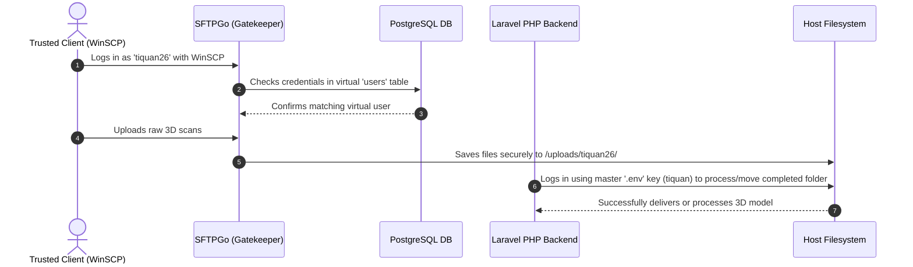

# SFTPGo vs. SFTP Master Credentials: Roles & Architecture

To build a secure, automated, and scalable web portal, it is standard software engineering practice to separate the **program that runs the security rules** from the **key used to manage the system** (Separation of Concerns).

In the 3D Hub Data Portal, **SFTPGo** acts as the **software program (the gatekeeper)**, while the `.env` **SFTP Delivery Credentials** act as the **system key (the administrative passkey)**. 

This document explains why both components are vital during both the development stage and after deploying to the production cloud server.

---

## 🔑 1. Understanding the Core Difference

* **SFTPGo (The Gatekeeper Engine):**
  SFTPGo is an independent software application installed on the server that listens for SFTP file transfers. It acts as an **intelligent firewall**. Instead of allowing external users to touch your raw Linux operating system, SFTPGo intercepts their connections, checks their username against the database, and traps them in a private virtual folder (sandbox).
  
* **The `.env` SFTP Credentials (`SFTP_DELIVERY_`):**
  These are the **system-level root credentials** of the actual Linux hosting machine. They give your Laravel PHP website the authority to log in to the server backend globally to move files, sync databases, create user folders, and override file permissions.

---

## 📊 2. Architectural Comparison

| Feature | SFTPGo (The Gatekeeper Engine) | `.env` SFTP Credentials (The System Key) |
| :--- | :--- | :--- |
| **What is it?** | A running software application (service). | Plain-text credentials (username/password). |
| **Who uses it?** | **Your Clients/Users** (to securely upload large 3D scans) and **Admins** (to monitor transfers). | **Your Laravel PHP Backend Code** (to execute automatic file management tasks behind-the-scenes). |
| **Access Scope** | **Extremely Restrictive (Sandboxed):** Users can only see their own `/uploads/{username}` folder. | **Unlimited (Global):** Can read, write, modify, or delete any file on the hosting server. |
| **Storage Method** | Virtual users stored inside the database. | Defined securely inside the `.env` file of the server. |
| **Security Risk** | **Low:** If a client account is hacked, only that client's raw scans are exposed. | **Extreme:** If these keys are leaked, the entire server can be completely compromised. |

---

## 🛠️ 3. Stage-by-Stage Necessity

### 💻 A. During the Development Stage (Local Computer)
Even though you are only testing on a local machine, having both components is vital:
1. **Simulation of the Real World:** To write reliable code, your local environment must mirror the exact behavior of the cloud. Having SFTPGo running locally ensures your Laravel code can practice creating virtual directories and synchronizing database records without throwing errors.
2. **Testing File Handover Scripts:** When a user uploads a file, your code runs a script to "confirm received." The PHP backend uses the `.env` system key to log in, scan the folder, and verify the files were written correctly. Without both, you could not test if uploads actually work.

### 🚀 B. After Deployment to the Real Server (DigitalOcean)
When you move to a real cloud droplet with live clients, the necessity of having both becomes a strict security requirement:

1. **Protecting the Cloud Server (The Sandboxing Rule):**
   If you didn't have SFTPGo, your Laravel site would have to create real Linux system accounts on the droplet for every "Trusted" user. If a client logged in, they could potentially break out of their folder, access other clients' secret projects, or run dangerous scripts. 
   
   **SFTPGo prevents this.** It runs as a gatekeeper, creating virtual logins (`tiquan26`, etc.) that only exist in its own isolated database, keeping your droplet 100% safe.

2. **Automating File Deliveries (The Automation Rule):**
   When your company processes a client's 3D scan and marks it as "Delivered", the Laravel system must move that massive output folder into the client's private directory. The PHP code uses the `.env` master credentials (`SFTP_DELIVERY_USERNAME=tiquan`) to log in via SSH/SFTP under the hood and securely deliver the completed 3D model.

---

## 🔄 4. How They Work Together in a Secure Loop

